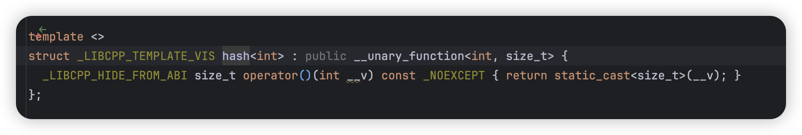

## HashMap benchmarks in rust/java/cpp
创建本仓库对 HashMap 进行 benchmark 的起因是: [bilibili video](https://www.bilibili.com/video/BV1RTiceCEr6/)

目前只针对 HashMap 的 get 操作，并复现视频中的测试方式，只针对 Rust/Java/C++ 语言进行测试，因为目前我对 Rust/C++较为熟悉，而视频中提到的是 Java ，所以也加入了进来

欢迎优化改进这些测试代码，也欢迎提交其他语言 HashMap 的测试代码，这方面的更新与改进请在 issue 中提出

### Benchmark Env
CPU: Apple M3 Pro

Rust: cargo 1.82.0-nightly (b5d44db1d 2024-07-26)
C++: Homebrew clang version 18.1.8
Java: openjdk-23.0.1


### Becnchmark Result
#### Rust
[source code](./rust_map/)

测试了标准库的 HashMap 以及 hashbrown 的 HashMap，并测试了它们取默认 hash_builder 和 no_hash_builder 的测试结果。

std::HashMap:
```sh
cargo run --release --bin bench_std_map                                                                                                                                                    ─╯
    Finished `release` profile [optimized] target(s) in 0.06s
     Running `target/release/bench_std_map`
StdHashMap default hash_builder:
test round 96, sum:1783293664, elapsed:7.113541ms
test round 97, sum:1783293664, elapsed:7.495459ms
test round 98, sum:1783293664, elapsed:10.375125ms
test round 99, sum:1783293664, elapsed:13.671334ms
StdHashMap no_hash_builder:
test round 96, sum:1783293664, elapsed:684.542µs
test round 97, sum:1783293664, elapsed:702.417µs
test round 98, sum:1783293664, elapsed:705.709µs
test round 99, sum:1783293664, elapsed:702.333µs
```

hashbrown::HashMap:
```sh
cargo run --release --bin bench_hashbrown_map                                                                                                                                              ─╯
    Finished `release` profile [optimized] target(s) in 0.04s
     Running `target/release/bench_hashbrown_map`
HashbrownMap default hash_builder:
test round 96, sum:1783293664, elapsed:2.671125ms
test round 97, sum:1783293664, elapsed:2.639959ms
test round 98, sum:1783293664, elapsed:2.662959ms
test round 99, sum:1783293664, elapsed:4.181291ms
HashbrownMap no_hash_builder:
test round 96, sum:1783293664, elapsed:705.667µs
test round 97, sum:1783293664, elapsed:715µs
test round 98, sum:1783293664, elapsed:702.417µs
test round 99, sum:1783293664, elapsed:699.333µs
```

#### C++
[source code](./cpp_map/)
std::unordered_map:
```sh
test round 96, sum: 1783293664, elapsed: 1.60 ms
test round 97, sum: 1783293664, elapsed: 1.57 ms
test round 98, sum: 1783293664, elapsed: 1.55 ms
test round 99, sum: 1783293664, elapsed: 1.55 ms
```
SwissTable:
```sh
test round 96, sum: 1783293664, elapsed: 2.71 ms
test round 97, sum: 1783293664, elapsed: 2.75 ms
test round 98, sum: 1783293664, elapsed: 3.70 ms
test round 99, sum: 1783293664, elapsed: 2.77 ms
```

这里出现 SwissTable 表现不如 C++ 自带的标准库，这个行为非常异常，后续查看源码发现 C++ 自带的哈希表哈希函数返回的是直接的 int 值，这就解释的通了。


#### Java
[souce code](./java_map/)

```sh
test round 96, sum: 1783293664, elapsed: 3.29 ms
test round 97, sum: 1783293664, elapsed: 9.29 ms
test round 98, sum: 1783293664, elapsed: 3.94 ms
test round 99, sum: 1783293664, elapsed: 3.97 ms
```

#### Summary
1. 测试不严谨，对于 get 的访问都是顺序的，在真实情况的负载几乎不可能出现
2. 出现 Java 比 Rust 标准库 HashMap get 操作快的根本原因应该就是哈希函数在完全顺序的 int 插入情况下使得数据在容器内部分布不均，并且最终测试也是基于顺序访问，这直接影响了 CPU cacheline 的命中率
3. Rust no_hash & C++ no_hash vs Java 得出结论：Java 这类基于 JVM 运行的语言在预热后基于 JIT 技术运行效率也还不错（只是在 int 的负载下），与 Native 语言差不多有五倍的性能差距，我认为差距应该主要是运行时的动态开销（比如所有容器的抽象都基于类型擦除的 Object），这个开销我认为在 K V 类型为其他复杂类型如 String 或者其他自定义 Object 的情况下会有更大的开销（应该超过现在的 5 倍差距，待验证）
4. Rust vs C++ 得出结论：同样的 [SwissTable](https://abseil.io/blog/20180927-swisstables) 实现来看，两者表现几乎一致没有太大偏差，而对比都使用了 no_hash 的标准库来看，C++ 的实现比 Rust 略慢a，应该是实现细节的差异，但具体没有细究